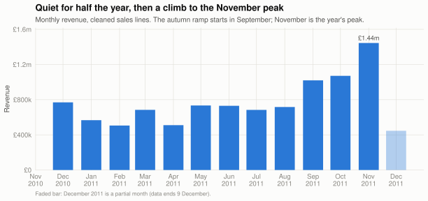

# One year of online retail — a small, reproducible analysis in R

[](https://github.com/Kenchch/online-retail-analysis-r/actions/workflows/ci.yml)
[](LICENSE)

A complete but deliberately small, reproducible data analysis in R.

**Read the analysis here: [analysis.md](analysis.md)** — it renders directly
on GitHub with all figures and tables.

## At a glance

| Input | Audited output | Reproducibility |
|---|---|---|
| **541,909** invoice lines | **524,786** clean sales lines · **£9.88m** revenue | SHA-256-pinned download · fingerprinted cache · **6/6 tests** |



Rebuild the complete analysis from a clean clone:

```sh
Rscript R/get_data.R && Rscript tests/run_tests.R && Rscript run_analysis.R
```

## Why it looks the way it does

The project uses R and SQL in a small production-style pipeline rather than a
notebook:

| Capability | Where it shows up here |
|---|---|
| R development | Shared functions in [`R/functions.R`](R/functions.R); the report, the driver and the tests all call the same code |
| SQL | Business questions answered in SQLite — aggregates and a window function in [`sql/queries.sql`](sql/queries.sql), executed from R via DBI |
| Reproducible pipelines | One command rebuilds everything from raw data; the input is sha256-pinned ([`R/get_data.R`](R/get_data.R)); the clean-data cache carries a fingerprint of the raw file *and* the cleaning code, so editing a rule rebuilds honestly instead of serving stale results |
| Quality practice | Documented cleaning rules with an audit that reconciles to the row ([`output/cleaning_audit.csv`](output/cleaning_audit.csv)); unit tests in [`tests/`](tests/) covering the cleaning rules, credit-note netting, and the SQL round-trip |
| Documentation | The knitted report narrates method, findings *and* limitations — partial months are flagged in the data as well as the prose, and the forecast's caveats are part of the forecast |

One cleaning decision is worth highlighting: the two largest "orders" of the
year (80,995 and 74,215 units) were both **cancelled within minutes** of
being keyed in. Simply excluding cancellation invoices — the obvious first
cut — would have left those phantom sales at the top of every headline
table. The pipeline instead nets each credit note against its matching sale
(same customer, product, quantity, price), so both sides of a cancelled pair
are removed and the "top products" are things the business actually sold.

## Reconciliation with retail-ai-pipeline

This repository and
[`retail-ai-pipeline`](https://github.com/Kenchch/retail-ai-pipeline) use the
same SHA-256-pinned UCI workbook but apply different accounting rules:

| Bridge | Revenue |
|---|---:|
| Python pipeline: valid positive sales | £10,247,353.28 |
| Matched sales removed when a credit note reverses them | −£394,233.81 |
| Exact duplicate rows retained by this R analysis | +£24,241.34 |
| **This analysis: cancellation-netted sales** | **£9,877,360.81** |

Neither result is presented as a universal definition of revenue. The Python
pipeline measures accepted positive invoice lines; this analysis estimates net
sales after matching credit notes. The bridge makes that scope difference
explicit and reproducible.

## How this was built

Built with AI pair-programming (Claude Code and OpenAI Codex) for drafting,
refactoring and test scaffolding. I defined the analysis, selected the cleaning
and credit-note rules, verified the reconciliations, and reviewed and edited the
code. Commits where an assistant contributed code retain a `Co-Authored-By`
trailer.

## Data

[UCI Online Retail](https://doi.org/10.24432/C5BW33) (Chen, 2015, CC BY 4.0):
541,909 invoice lines from a UK online giftware retailer, 1 Dec 2010 – 9 Dec
2011. `R/get_data.R` fetches it from a stable public mirror (the UCI host is
unreliable) and verifies a pinned sha256 before anything reads it. The raw
file is never committed (`data/raw/` is gitignored); the download script is
how it arrives.

## Running it

Requires R (≥ 4.3) with: readr, dplyr, lubridate, ggplot2, scales, svglite,
stringr, DBI, RSQLite, zoo, forecast, knitr, rmarkdown — all available as
Debian/Ubuntu `r-cran-*` packages or from CRAN — plus pandoc for knitting.
Run everything from the project root:

```sh
Rscript R/get_data.R       # fetch + verify the raw data
Rscript tests/run_tests.R  # unit tests (exit non-zero on failure)
Rscript run_analysis.R     # clean -> SQL -> output/ tables -> analysis.md
```

## Layout

```
├── README.md            this file
├── analysis.Rmd         the report source
├── analysis.md          the knitted report (committed - read this)
├── run_analysis.R       one-command driver: clean -> SQL -> tables -> knit
├── R/
│   ├── functions.R      all shared logic: load, clean, SQL layer, analysis, theme
│   └── get_data.R       sha256-verified data fetch
├── sql/queries.sql      the SQL, as SQL - named queries parsed and run from R
├── tests/               stopifnot()-based unit tests + runner
├── output/              committed summary tables (one CSV per SQL query + audit)
├── data/raw/            the downloaded input (gitignored)
└── cache/               fingerprinted local intermediates (gitignored)
```

## Findings, in one breath

After netting out cancelled sales, 541,909 raw lines become 524,786 clean
sales lines worth £9.88m. Revenue is flat through the first half of the
year, then climbs from September to a November peak at roughly double the
mid-year level; it is a weekday (trade) business with no Saturday trading;
the top ten products earn about 8% of revenue; the UK is ~85% of the
business; repeat buyers are 64% of identified customers but ~93% of
identified revenue, and the top decile of customers alone carries ~60% —
concentration, not volume, is the commercial risk. A four-week ETS forecast
holds the current level, fit only on the unbroken run of trading weeks after
the year-end closure, with the stated caveat that one year of history cannot
teach a model the December cliff. Details and charts:
[analysis.md](analysis.md).
