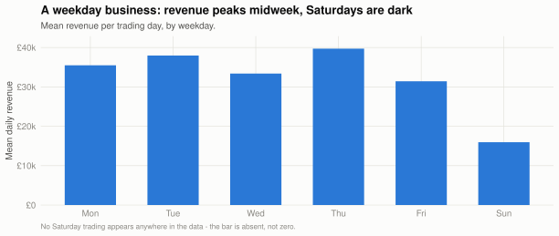
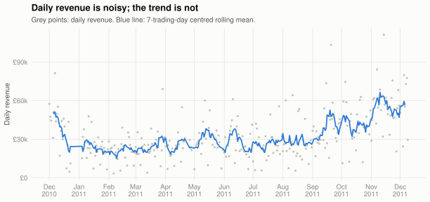
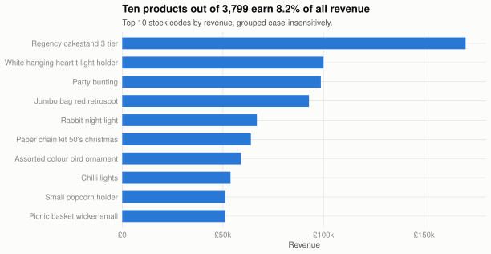
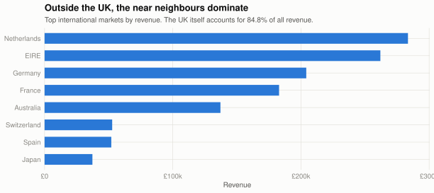
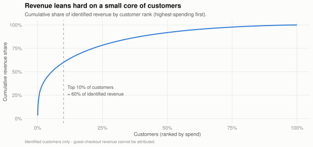
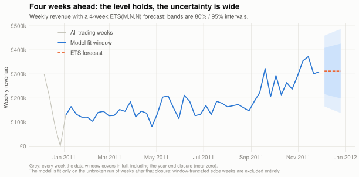

One year of online retail: a small, reproducible analysis in R
================
Feng Jiang

- [What this is](#what-this-is)
- [Cleaning: every dropped row is accounted
  for](#cleaning-every-dropped-row-is-accounted-for)
- [Revenue over time (SQL)](#revenue-over-time-sql)
- [The trading week](#the-trading-week)
- [What sells, and where (SQL)](#what-sells-and-where-sql)
- [Customer concentration](#customer-concentration)
- [A short-horizon forecast, with its caveats
  attached](#a-short-horizon-forecast-with-its-caveats-attached)
- [Reproducing this document](#reproducing-this-document)

## What this is

A deliberately small end-to-end analysis of the [UCI Online
Retail](https://doi.org/10.24432/C5BW33) dataset — every transaction of
a UK-based online giftware wholesaler/retailer from 01 December 2010 to
09 December 2011. The point is the working style, not the dataset:
documented cleaning rules with a reconciling audit trail, business
questions answered in SQL, time series and customer analysis in R, and a
report that rebuilds from raw data with one command
(`Rscript run_analysis.R`).

## Cleaning: every dropped row is accounted for

The raw file is invoice *lines*, and it mixes real product sales with
cancellations, postage charges, fees, and manual stock corrections. Five
rules are applied in a fixed order; each row is counted against the
first rule that removes it, so the audit reconciles exactly against the
input.

The netting rule earns its place: the two largest “orders” of the year
(80,995 and 74,215 units) were both **cancelled within minutes** of
being keyed in. Dropping only the credit notes — the obvious first cut —
would leave those phantom sales in every top-product and top-customer
list below; matching each credit note back to its sale (same customer,
product, quantity and price) removes both sides of the pair. Credits are
processed in time order; each consumes the latest unused sale at or
before its timestamp. Same-minute matches are allowed because the source
timestamp has minute precision, with input row order breaking ties. An
earlier credit cannot cancel a future sale.

**Correction (2026-09-05):** enforcing this chronological rule restores
263 sales lines and £6,299.05 compared with the previous report. The old
code matched credit counts over the entire observation window; all
tables and figures below have been regenerated with chronological
matching.

``` r
knitr::kable(
  cleaned$audit |>
    mutate(share_of_input = percent(share_of_input, accuracy = 0.1)),
  col.names = c("Rule (applied in order)", "Rows dropped", "Share of input"),
  format.args = list(big.mark = ",")
)
```

| Rule (applied in order) | Rows dropped | Share of input |
|:---|---:|:---|
| Credit notes (InvoiceNo starting with ‘C’) | 9,288 | 1.7% |
| Sales offset by a matching credit note (same customer, product, quantity, price) | 2,787 | 0.5% |
| Service charges / adjustments (postage, fees, manual entries) | 2,284 | 0.4% |
| Non-positive quantity (stock corrections without a credit note) | 1,336 | 0.2% |
| Non-positive unit price (damaged / unsaleable write-offs) | 1,165 | 0.2% |

541,909 raw rows become 525,049 clean sales lines (3.1% dropped), worth
£9.88m in revenue.

**Matching coverage:** 2,787 sale lines were matched one-to-one to 9,288
credit-note lines, or 30.0% of all credit-note lines. The denominator
includes every C-prefixed line, including lines that are ineligible for
matching. Matching happens before service-code filtering, so this is
process coverage, not the share of product returns whose value was
recovered. Unmatched and partial credits are not netted.

**Three measures, because one number cannot carry the caveat.** The
headline here is net of *matched* credits only. The credits that could
not be paired off are still out there, and the headline cannot be judged
without knowing what they are worth:

| Measure | Revenue | Basis |
|:---|:---|---:|
| Gross positive product sales | £10,272,118.87 | Sales lines only; service codes and non-positive rows removed |
| Net of matched credit notes (headline) | £9,883,659.86 | 2,787 of 9,288 credit lines matched one-to-one |
| Net of every product credit note (floor) | £9,793,394.69 | Every product credit subtracted, matched or not |

The floor is a bound, not an alternative headline: it subtracts credits
for sales made before this window opened, whose matching sale is not in
the file at all, so it removes value the gross figure never contained.
The true net sits between the two, and this report does not claim to
know where.

Two caveats worth stating up front:

- **Netting is exact-match only.** A credit note nets a sale only when
  customer, product, quantity and price all agree; partial returns and
  returns of pre-window sales find no match and simply drop out. Revenue
  is therefore net of clean cancellations but still slightly *gross* of
  messy returns.
- **A quarter of lines have no customer ID** (25.0% of clean lines —
  guest checkouts). They stay in revenue figures but cannot be used for
  customer-level analysis, which is therefore based on identified
  revenue only.

## Revenue over time (SQL)

Monthly totals come straight from SQLite — the cleaned lines are loaded
into a database and the business questions are answered in SQL
([`sql/queries.sql`](sql/queries.sql)). This dataset would fit in a data
frame comfortably; the point of the SQL layer is that these are exactly
the queries that live in a warehouse in production, and writing them as
SQL keeps them portable to one.

``` r
knitr::kable(
  sql$monthly_summary |>
    left_join(sql$monthly_growth |> select(month, mom_growth_pct), by = "month") |>
    mutate(
      revenue = label_gbp(revenue),
      # The first month has nothing to grow from; a bare NA in a rendered
      # table reads as an error, not an inapplicable cell.
      mom_growth_pct = coalesce(as.character(mom_growth_pct), "—")
    ),
  col.names = c("Month", "Revenue", "Invoices", "Identified customers",
                "Revenue / invoice (£)", "MoM growth (%)"),
  format.args = list(big.mark = ",")
)
```

| Month | Revenue | Invoices | Identified customers | Revenue / invoice (£) | MoM growth (%) |
|:---|:---|---:|---:|---:|:---|
| 2010-12 | £769k | 1,542 | 883 | 498.92 | — |
| 2011-01 | £567k | 1,073 | 737 | 528.25 | -26.3 |
| 2011-02 | £506k | 1,089 | 756 | 464.74 | -10.7 |
| 2011-03 | £684k | 1,431 | 970 | 478.04 | 35.2 |
| 2011-04 | £511k | 1,226 | 849 | 416.40 | -25.4 |
| 2011-05 | £734k | 1,652 | 1,051 | 444.37 | 43.8 |
| 2011-06 | £730k | 1,512 | 986 | 482.86 | -0.5 |
| 2011-07 | £684k | 1,445 | 945 | 473.29 | -6.3 |
| 2011-08 | £717k | 1,336 | 933 | 536.47 | 4.8 |
| 2011-09 | £1.02m | 1,808 | 1,254 | 564.06 | 42.3 |
| 2011-10 | £1.07m | 1,986 | 1,356 | 539.39 | 5 |
| 2011-11 | £1.44m | 2,740 | 1,657 | 527.31 | 34.9 |
| 2011-12 | £446k | 811 | 610 | 550.12 | -69.1 |

``` r
monthly <- sql$monthly_summary |>
  mutate(
    month_date = as_date(paste0(month, "-01")),
    # December 2011 stops on the 9th - eight trading days dressed up as a
    # month would read as a collapse, so the partial month is flagged.
    partial = month_date + months(1) - days(1) > span[2]
  )

ggplot(monthly, aes(month_date, revenue)) +
  geom_col(aes(alpha = partial), fill = PAL$blue, width = 22, show.legend = FALSE) +
  scale_alpha_manual(values = c(`FALSE` = 1, `TRUE` = 0.35)) +
  geom_text(
    data = filter(monthly, revenue == max(revenue)),
    aes(label = label_gbp(revenue)),
    vjust = -0.6, size = 3.2, colour = PAL$ink2
  ) +
  scale_y_continuous(labels = label_gbp, expand = expansion(mult = c(0, 0.12))) +
  scale_x_date(date_breaks = "1 month", date_labels = "%b\n%Y") +
  labs(
    title = "Quiet for half the year, then a climb to the November peak",
    subtitle = "Monthly revenue, cleaned sales lines. The autumn ramp starts in September; November is the year's peak.",
    x = NULL, y = "Revenue",
    caption = "Faded bar: December 2011 is a partial month (data ends 9 December)."
  ) +
  theme_retail()
```

<!-- -->

The shape is a giftware wholesaler’s year in one picture: an
unremarkable first half, an autumn ramp as retail customers stock up for
Christmas, a 34.9% November jump — and a December bar that only looks
like a crash because the data stops on the 9th (its `trading_days`
column in [`output/monthly_growth.csv`](output/monthly_growth.csv) says
the same to anyone reading the CSV without this caption).

## The trading week

``` r
wd <- weekday_profile(lines)

ggplot(wd, aes(weekday, mean_daily_revenue)) +
  geom_col(fill = PAL$blue, width = 0.62) +
  scale_y_continuous(labels = label_gbp, expand = expansion(mult = c(0, 0.08))) +
  labs(
    title = "A weekday business: revenue peaks midweek, Saturdays are dark",
    subtitle = "Mean revenue per trading day, by weekday.",
    x = NULL, y = "Mean daily revenue",
    caption = "No Saturday trading appears anywhere in the data - the bar is absent, not zero."
  ) +
  theme_retail()
```

<!-- -->

The peak day (Thu) averages £40k in revenue, against £16k on the
quietest day — consistent with trade (B2B) customers ordering in working
hours rather than consumers browsing on weekends.

``` r
daily <- daily_revenue(lines)

ggplot(daily, aes(day, revenue)) +
  geom_point(colour = "#c3c2b7", size = 0.7) +
  geom_line(aes(y = rolling_7d), colour = PAL$blue, linewidth = 0.8, na.rm = TRUE) +
  scale_y_continuous(labels = label_gbp) +
  scale_x_date(date_breaks = "1 month", date_labels = "%b\n%Y") +
  labs(
    title = "Daily revenue is noisy; the trend is not",
    subtitle = "Grey points: daily revenue. Blue line: 7-trading-day centred rolling mean.",
    x = NULL, y = "Daily revenue"
  ) +
  theme_retail()
```

<!-- -->

Single-day spikes (a handful of very large wholesale orders) make the
daily series jumpy; the rolling mean shows the underlying level is flat
until August 2011 and then climbs for four straight months.

## What sells, and where (SQL)

``` r
knitr::kable(
  sql$top_products |> mutate(revenue = label_gbp(revenue)),
  col.names = c("Stock code", "Description", "Revenue", "Units", "Invoices"),
  format.args = list(big.mark = ",")
)
```

| Stock code | Description                        | Revenue |  Units | Invoices |
|:-----------|:-----------------------------------|:--------|-------:|---------:|
| 22423      | REGENCY CAKESTAND 3 TIER           | £171k   | 13,537 |    1,948 |
| 85123A     | WHITE HANGING HEART T-LIGHT HOLDER | £100k   | 35,428 |    2,253 |
| 47566      | PARTY BUNTING                      | £99k    | 18,103 |    1,675 |
| 85099B     | JUMBO BAG RED RETROSPOT            | £93k    | 47,593 |    2,078 |
| 23084      | RABBIT NIGHT LIGHT                 | £67k    | 30,758 |      991 |
| 22086      | PAPER CHAIN KIT 50’S CHRISTMAS     | £64k    | 18,948 |    1,152 |
| 84879      | ASSORTED COLOUR BIRD ORNAMENT      | £59k    | 36,432 |    1,452 |
| 79321      | CHILLI LIGHTS                      | £54k    | 10,229 |      658 |
| 22197      | SMALL POPCORN HOLDER               | £51k    | 56,699 |    1,389 |
| 22502      | PICNIC BASKET WICKER SMALL         | £51k    |  1,872 |      460 |

``` r
top <- sql$top_products |>
  mutate(label = stringr::str_trunc(stringr::str_to_sentence(description), 34))

ggplot(top, aes(revenue, reorder(label, revenue))) +
  geom_col(fill = PAL$blue, width = 0.62) +
  scale_x_continuous(labels = label_gbp, expand = expansion(mult = c(0, 0.06))) +
  labs(
    title = paste0("Ten products out of ", comma(n_distinct(toupper(lines$stock_code))),
                   " earn ", percent(sum(sql$top_products$revenue) / total_revenue, accuracy = 0.1),
                   " of all revenue"),
    subtitle = "Top 10 stock codes by revenue, grouped case-insensitively.",
    x = "Revenue", y = NULL
  ) +
  theme_retail()
```

<!-- -->

``` r
uk_share <- sql$country_summary |>
  filter(country == "United Kingdom") |> pull(revenue_share_pct)

intl <- sql$country_summary |>
  filter(country != "United Kingdom") |>
  slice_max(revenue, n = 8)

ggplot(intl, aes(revenue, reorder(country, revenue))) +
  geom_col(fill = PAL$blue, width = 0.62) +
  scale_x_continuous(labels = label_gbp, expand = expansion(mult = c(0, 0.06))) +
  labs(
    title = "Outside the UK, the near neighbours dominate",
    subtitle = paste0("Top international markets by revenue. The UK itself accounts for ",
                      uk_share, "% of all revenue."),
    x = "Revenue", y = NULL
  ) +
  theme_retail()
```

<!-- -->

This is overwhelmingly a domestic business (84.8% UK), with the
Netherlands, Ireland, Germany and France making up most of the rest —
the kind of context that matters before anyone proposes “growing
international sales” off the back of one chart.

## Customer concentration

A *repeat* buyer here is a customer who bought on more than one calendar
day — a same-day flurry of invoices still counts as one visit. Guest
checkouts cannot be attributed to anyone, so this section covers
identified revenue only.

``` r
knitr::kable(
  sql$customer_repeat |> mutate(revenue = label_gbp(revenue)),
  col.names = c("Customer type", "Identified customers", "Revenue",
                "Share of identified revenue (%)"),
  format.args = list(big.mark = ",")
)
```

| Customer type | Identified customers | Revenue | Share of identified revenue (%) |
|:--------------|---------------------:|:--------|--------------------------------:|
| one-off       |                1,555 | £622k   |                             7.4 |
| repeat        |                2,769 | £7.75m  |                            92.6 |

``` r
pareto <- customer_pareto(lines)
top10_share <- pareto |> filter(customer_pct >= 0.10) |> slice(1) |> pull(revenue_share)

ggplot(pareto, aes(customer_pct, revenue_share)) +
  geom_line(colour = PAL$blue, linewidth = 0.9) +
  geom_vline(xintercept = 0.10, colour = PAL$muted, linetype = "dashed", linewidth = 0.4) +
  annotate(
    "text", x = 0.115, y = 0.30, hjust = 0, size = 3.2, colour = PAL$ink2,
    label = paste0("Top 10% of customers\n= ", percent(top10_share, accuracy = 1), " of identified revenue")
  ) +
  scale_x_continuous(labels = percent) +
  scale_y_continuous(labels = percent, limits = c(0, 1)) +
  labs(
    title = "Revenue leans hard on a small core of customers",
    subtitle = "Cumulative share of identified revenue by customer rank (highest-spending first).",
    x = "Customers (ranked by spend)", y = "Cumulative revenue share",
    caption = "Identified customers only - guest-checkout revenue cannot be attributed."
  ) +
  theme_retail()
```

<!-- -->

Repeat buyers are 64% of identified customers but 92.6% of identified
revenue, and the top decile alone carries 60%. Losing a handful of key
accounts would show up directly in the monthly numbers — concentration,
not volume, is this retailer’s real commercial risk.

## A short-horizon forecast, with its caveats attached

``` r
weekly <- weekly_revenue(lines)
fc <- forecast_weekly(weekly, h = 4)

ggplot() +
  geom_ribbon(
    data = fc$forecast, aes(week, ymin = lo95, ymax = hi95),
    fill = PAL$band, alpha = 0.55
  ) +
  geom_ribbon(
    data = fc$forecast, aes(week, ymin = lo80, ymax = hi80),
    fill = PAL$band
  ) +
  geom_line(data = fc$history, aes(week, revenue, colour = "All trading weeks"),
            linewidth = 0.5) +
  geom_line(data = fc$fit_run, aes(week, revenue, colour = "Model fit window"),
            linewidth = 0.8) +
  geom_line(
    data = fc$forecast, aes(week, mean, colour = "ETS forecast"),
    linewidth = 0.8, linetype = "21"
  ) +
  scale_colour_manual(
    NULL,
    values = c("All trading weeks" = "#c3c2b7", "Model fit window" = PAL$blue,
               "ETS forecast" = PAL$orange),
    breaks = c("All trading weeks", "Model fit window", "ETS forecast")
  ) +
  scale_y_continuous(labels = label_gbp) +
  scale_x_date(date_breaks = "2 months", date_labels = "%b %Y") +
  labs(
    title = "Four weeks ahead: the level holds, the uncertainty is wide",
    subtitle = paste0("Weekly revenue with a 4-week ", fc$fit$method,
                      " forecast; bands are 80% / 95% intervals."),
    x = NULL, y = "Weekly revenue",
    caption = paste0(
      "Grey: every week the data window covers in full, including the year-end closure (near zero).\n",
      "The model is fit only on the unbroken run of weeks after that closure; ",
      "window-truncated edge weeks are excluded entirely."
    )
  ) +
  theme_retail() +
  theme(legend.position = c(0.17, 0.85), legend.background = element_blank())
```

<!-- -->

Two modelling choices are doing the honest work here. The model is fit
only on the **unbroken run of weeks after the year-end closure**: `ts()`
has no notion of a calendar, so handing it the closure week (the grey
plunge to near zero) or the data window’s truncated edge weeks would
teach the level a collapse that is really a holiday. And it is
deliberately **non-seasonal**: with thirteen months of history there is
exactly one observation of any annual pattern, so a seasonal term would
be fit to noise. That is also this forecast’s honest limitation — it
projects the current level, and the *known* story of this business (the
chart above it) says December falls off a Christmas cliff that a
one-year series cannot teach a model. In production this would be the
argument for pooling more history before forecasting, not for a fancier
model on the same data.

## Reproducing this document

    Rscript R/get_data.R       # fetch + verify the raw data (sha256-pinned)
    Rscript tests/run_tests.R  # unit tests for cleaning + SQL plumbing
    Rscript run_analysis.R     # clean -> SQL -> tables -> knit this report

The packages this report is built with, and the versions
[`renv.lock`](renv.lock) pins them to:

``` r
attached <- sessionInfo()$otherPkgs
tibble(
  Package = names(attached),
  Version = vapply(attached, function(p) p$Version, character(1))
) |>
  arrange(Package) |>
  knitr::kable(row.names = FALSE)
```

| Package   | Version |
|:----------|:--------|
| DBI       | 1.3.0   |
| RSQLite   | 3.53.3  |
| dplyr     | 1.2.1   |
| forecast  | 9.0.2   |
| ggplot2   | 4.0.3   |
| lubridate | 1.9.5   |
| readr     | 2.2.0   |
| scales    | 1.4.0   |
| zoo       | 1.9-0   |

`run_analysis.R` writes the full `sessionInfo()` — R build, platform,
locale, BLAS and time zone — to `output/session_info.txt` on the machine
that runs it, rather than embedding it here. It used to be embedded, and
that made this document unreproducible by construction: rendering it on
a different machine rewrote the platform, locale, BLAS and time-zone
lines, so a `git diff` on `analysis.md` reported a change on every run
even when every number was identical. A record that cannot be compared
cannot be checked, and a check that always fails is one nobody reads.
That file is deliberately not committed, for the same reason.

The package table above stays put because `renv.lock` pins those
versions, so it is the same everywhere the lockfile is restored — which
is the part of the environment the results actually depend on.
